  

 

  
  
  
  
  &nbsp;·&nbsp; 📍 Lima, Perú

---

## 🛠️ Tecnologías

**Frontend**

  

**Backend & Bases de datos**

  

**Móvil & Game Dev**

  

**Herramientas**

  

---

## 🚀 Proyectos destacados

**Nova Smart** — Sistema de gestión de operaciones de campo para HFC/FTTH
- Módulo completo de inventario/almacén con jerarquía de 4 roles (Almacén General, Subalmacenes, Supervisores, Técnicos).
- Modelo de datos de movimientos de inventario con actualización virtual basada en confirmaciones.
- Arquitectura de permisos que separa roles de negocio de la visibilidad de UI por usuario.
- Backend en Supabase, frontend en React Native.

**GOYO MOTOR'S / Gestor-moto** — Sistema POS para repuestos de motos
- Lógica de stock FIFO y sistema de crédito acumulativo por cliente.
- Generación de PDFs (ventas, tickets, reportes de caja, créditos) con logo y layout personalizados.
- Migración planificada a Supabase con Row Level Security.
- Stack: Next.js + Firebase/PostgreSQL.

**Ayni.pe** — Marketplace de servicios peruano
- App con doble rol (cliente/profesional) bajo un mismo UID.
- Sistema de comisión oculta del 15%, pagos simulados (Yape/Plin) y verificación KYC.
- Matching por geolocalización.
- Stack: Expo/React Native + Firebase.

**SIMATV** — Aplicación IPTV para Android TV
- Reproducción con ExoPlayer/Media3, integración de EPG y navegación optimizada para control remoto.
- UI premium dorado sobre azul marino, con almacenamiento cifrado (EncryptedSharedPreferences).
- Stack: Kotlin nativo.

**Consultas Perú** — Herramienta de consulta DNI/RUC
- API routes serverless, cacheo en Firestore e integración con Factiliza API.
- Stack: Next.js + Vercel + Firebase.

**RESCUEMAL** — App móvil de rescate animal
- Arquitectura híbrida Kotlin/Java, integración con Google Maps Platform para geolocalización y trazado de rutas.
- Datos en tiempo real con Cloud Firestore y evidencias fotográficas en Firebase Storage.

**Herramienta CLI para Git & GitHub**
- CLI multiplataforma en Node.js que automatiza todo el ciclo de vida de un repositorio (init, staging, commits, sync).
- Integración con la API de GitHub para autenticación y aprovisionamiento en la nube.
- Alias contextuales (`actualiza-edward`) para flujos de quick-push.

---

## 📊 Actividad

  

<picture>
  <source media="(prefers-color-scheme: dark)" srcset="https://raw.githubusercontent.com/EdwardPM05/EdwardPM05/pacman-output/pacman-contribution-graph-dark.svg">
  <source media="(prefers-color-scheme: light)" srcset="https://raw.githubusercontent.com/EdwardPM05/EdwardPM05/pacman-output/pacman-contribution-graph.svg">
  
</picture>

   
  Estudiante de Ingeniería de Software · Universidad Autónoma del Perú

